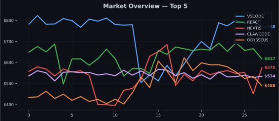

# GitExchange — The GitHub Stock Market

> Trade open-source repos like stocks. Prices driven by real GitHub activity.

🟢 **Market OPEN** | Total Cap: $1.95M | 10 Stocks | 1 Trader | Last Update: 2026-03-22 05:22 UTC

---

## Quick Start

1. Click a **Buy** or **Sell** link in the Market Board below
2. Adjust the quantity in the issue title, then submit
3. Your trade executes automatically — you'll get a receipt comment
4. Open an issue titled `PORTFOLIO` to see your holdings anytime

> New accounts must be at least 7 days old. Max 5 trades per hour.

---

## Market Board

| Ticker | Name | Price | 24h Change | Volume | Market Cap | Trade |
|--------|------|-------|------------|--------|------------|-------|
| **VSCODE** | microsoft/vscode | $680.70 | 🔴 -19.04% | 0 | $340.4K | [Buy](https://github.com/SolanaLeeky/GitExchange/issues/new?title=BUY+vscode+10&body=Adjust+quantity+in+the+title+then+submit) [Sell](https://github.com/SolanaLeeky/GitExchange/issues/new?title=SELL+vscode+5&body=Adjust+quantity+in+the+title+then+submit) [Short](https://github.com/SolanaLeeky/GitExchange/issues/new?title=SHORT+vscode+10&body=Adjust+quantity+in+the+title+then+submit) |
| **REACT** | facebook/react | $668.66 | 🔴 -3.74% | 7 | $334.3K | [Buy](https://github.com/SolanaLeeky/GitExchange/issues/new?title=BUY+react+10&body=Adjust+quantity+in+the+title+then+submit) [Sell](https://github.com/SolanaLeeky/GitExchange/issues/new?title=SELL+react+5&body=Adjust+quantity+in+the+title+then+submit) [Short](https://github.com/SolanaLeeky/GitExchange/issues/new?title=SHORT+react+10&body=Adjust+quantity+in+the+title+then+submit) |
| **NEXTJS** | vercel/next.js | $550.11 | 🔴 -0.60% | 5 | $275.1K | [Buy](https://github.com/SolanaLeeky/GitExchange/issues/new?title=BUY+nextjs+10&body=Adjust+quantity+in+the+title+then+submit) [Sell](https://github.com/SolanaLeeky/GitExchange/issues/new?title=SELL+nextjs+5&body=Adjust+quantity+in+the+title+then+submit) [Short](https://github.com/SolanaLeeky/GitExchange/issues/new?title=SHORT+nextjs+10&body=Adjust+quantity+in+the+title+then+submit) |
| **CLIANYTHING** | HKUDS/CLI-Anything | $447.56 | ⚪ 0.00% | 0 | $223.8K | [Buy](https://github.com/SolanaLeeky/GitExchange/issues/new?title=BUY+clianything+10&body=Adjust+quantity+in+the+title+then+submit) [Sell](https://github.com/SolanaLeeky/GitExchange/issues/new?title=SELL+clianything+5&body=Adjust+quantity+in+the+title+then+submit) [Short](https://github.com/SolanaLeeky/GitExchange/issues/new?title=SHORT+clianything+10&body=Adjust+quantity+in+the+title+then+submit) |
| **SVELTE** | sveltejs/svelte | $401.61 | 🟢 +2.14% | 6 | $200.8K | [Buy](https://github.com/SolanaLeeky/GitExchange/issues/new?title=BUY+svelte+10&body=Adjust+quantity+in+the+title+then+submit) [Sell](https://github.com/SolanaLeeky/GitExchange/issues/new?title=SELL+svelte+5&body=Adjust+quantity+in+the+title+then+submit) [Short](https://github.com/SolanaLeeky/GitExchange/issues/new?title=SHORT+svelte+10&body=Adjust+quantity+in+the+title+then+submit) |
| **DENO** | denoland/deno | $287.85 | 🔴 -7.07% | 0 | $143.9K | [Buy](https://github.com/SolanaLeeky/GitExchange/issues/new?title=BUY+deno+10&body=Adjust+quantity+in+the+title+then+submit) [Sell](https://github.com/SolanaLeeky/GitExchange/issues/new?title=SELL+deno+5&body=Adjust+quantity+in+the+title+then+submit) [Short](https://github.com/SolanaLeeky/GitExchange/issues/new?title=SHORT+deno+10&body=Adjust+quantity+in+the+title+then+submit) |
| **AUTORESEARCH** | karpathy/autoresearch | $238.83 | 🟢 +140.71% | 0 | $119.4K | [Buy](https://github.com/SolanaLeeky/GitExchange/issues/new?title=BUY+autoresearch+10&body=Adjust+quantity+in+the+title+then+submit) [Sell](https://github.com/SolanaLeeky/GitExchange/issues/new?title=SELL+autoresearch+5&body=Adjust+quantity+in+the+title+then+submit) [Short](https://github.com/SolanaLeeky/GitExchange/issues/new?title=SHORT+autoresearch+10&body=Adjust+quantity+in+the+title+then+submit) |
| **PAPERCLIP** | paperclipai/paperclip | $216.43 | 🟢 +238.60% | 0 | $108.2K | [Buy](https://github.com/SolanaLeeky/GitExchange/issues/new?title=BUY+paperclip+10&body=Adjust+quantity+in+the+title+then+submit) [Sell](https://github.com/SolanaLeeky/GitExchange/issues/new?title=SELL+paperclip+5&body=Adjust+quantity+in+the+title+then+submit) [Short](https://github.com/SolanaLeeky/GitExchange/issues/new?title=SHORT+paperclip+10&body=Adjust+quantity+in+the+title+then+submit) |
| **GSTACK** | garrytan/gstack | $216.10 | 🟢 +197.25% | 20 | $108.0K | [Buy](https://github.com/SolanaLeeky/GitExchange/issues/new?title=BUY+gstack+10&body=Adjust+quantity+in+the+title+then+submit) [Sell](https://github.com/SolanaLeeky/GitExchange/issues/new?title=SELL+gstack+5&body=Adjust+quantity+in+the+title+then+submit) [Short](https://github.com/SolanaLeeky/GitExchange/issues/new?title=SHORT+gstack+10&body=Adjust+quantity+in+the+title+then+submit) |
| **CLI** | googleworkspace/cli | $201.38 | 🟢 +348.11% | 0 | $100.7K | [Buy](https://github.com/SolanaLeeky/GitExchange/issues/new?title=BUY+cli+10&body=Adjust+quantity+in+the+title+then+submit) [Sell](https://github.com/SolanaLeeky/GitExchange/issues/new?title=SELL+cli+5&body=Adjust+quantity+in+the+title+then+submit) [Short](https://github.com/SolanaLeeky/GitExchange/issues/new?title=SHORT+cli+10&body=Adjust+quantity+in+the+title+then+submit) |

---

## Leaderboard

| Rank | Trader | Portfolio Value | P&L | Trades | Achievements |
|------|--------|-----------------|-----|--------|--------------|
| 🥇 | @SolanaLeeky | $11,409.34 | +$1,409.34 (+14.1%) | 5 | 🔔 🎯 |

---

## Price Chart (7 days)

---

## Recent Trades

| Time | Trader | Action | Stock | Qty | Price | Total |
|------|--------|--------|-------|-----|-------|-------|
| 2026-03-22 05:32 | @SolanaLeeky | 📉 SELL | SVELTE | 3 | $401.61 | $1,204.83 |
| 2026-03-22 05:29 | @SolanaLeeky | 📉 SELL | GSTACK | 10 | $216.10 | $2,161.00 |
| 2026-03-22 05:23 | @SolanaLeeky | 📈 BUY | SVELTE | 3 | $401.61 | $1,204.83 |
| 2026-03-22 03:50 | @SolanaLeeky | 📈 BUY | GSTACK | 10 | $72.70 | $727.00 |
| 2026-03-22 03:42 | @SolanaLeeky | 📈 BUY | NEXTJS | 5 | $553.43 | $2,767.15 |

---

## Trading Commands

| Command | Example | Description |
|---------|---------|-------------|
| `BUY <ticker> <qty>` | `BUY react 10` | Buy shares |
| `SELL <ticker> <qty>` | `SELL vscode 5` | Sell shares you own |
| `SHORT <ticker> <qty>` | `SHORT deno 20` | Bet on price decrease (150% margin required) |
| `COVER <ticker> <qty>` | `COVER deno 20` | Close a short position |
| `PORTFOLIO` | `PORTFOLIO` | View your holdings, P&L, and achievements |

## Rules

| Rule | Value |
|------|-------|
| Starting cash | $10,000 |
| Max position | 40% of portfolio in one stock |
| Trading fee | 0.1% per trade |
| Short margin | 150% of position value |
| Trade size | 1–100 shares per trade |
| Price updates | Every 6 hours (GitHub API metrics) |
| Dividends | Daily — 0.5% of price to holders of repos with 50+ commits/week |

## Achievements

| Badge | Name | How to Earn |
|-------|------|-------------|
| 🎯 | First Trade | Complete your first trade |
| 💯 | Century Trader | Make 100 trades |
| 🚀 | 10x Return | Portfolio value reaches 10x starting cash |
| 💎 | Diamond Hands | Hold a stock for 30+ days |
| 📄 | Paper Hands | Sell within 1 hour of buying |
| 👑 | Short King | Profit $5,000+ from short positions |
| 🌐 | Diversified | Hold 10+ different stocks |
| 🐋 | Whale | Single trade worth $5,000+ |
| 🛡️ | Survivor | Hold a stock through a crash event |
| 🔔 | IPO Hunter | Buy a stock on its IPO day |

## How Prices Work

Stock prices are calculated from five GitHub metrics, updated every 6 hours:

| Metric | Weight |
|--------|--------|
| Stars | 30% |
| Commits/week | 25% |
| Forks | 15% |
| Issue response time | 15% |
| Contributors | 15% |

Plus momentum (trend-following, capped at 8%) and volatility (random ±3%).

## Market Events

- **IPO** — Trending repos with 1,000+ stars get auto-listed
- **Crash** — Archived or deleted repos go to $0, holders wiped out
- **Short Squeeze** — If short interest exceeds 60% and price rises 10%+, all shorts force-closed
- **Dividends** — Repos with 50+ weekly commits pay shareholders daily

---

*Powered by GitHub Actions. Infrastructure cost: $0.*
*Prices update every 6 hours. Market data is committed to this repo.*
